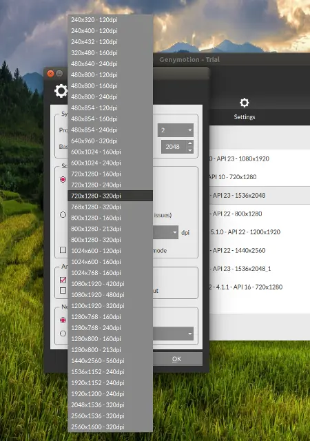

### 1.概述

Android发展至今，功能越来越多，越来越强大，不过碎片化的问题也是众所周知的越来越严重，如果是做大众应用，我相信屏幕适配肯定是我们不可回避的一个问题，当然了，网上的适配方案有很多，比如：

[Google的百度比布局](http://blog.csdn.net/lmj623565791/article/details/46695347)
[AutoLayout](http://blog.csdn.net/lmj623565791/article/details/49990941)
[Android适配方案](http://blog.csdn.net/lmj623565791/article/details/45460089)

...等等，大家如果有兴趣，可以去看看。
本方案实际上是第三种方案的一个演进！！！

### 2.在谈论屏幕适配之前，首先要知道的几个概念
- 物理像素点(px)：代表的是手机的物理像素点。
- 密度无关像素(dp)：密度无关像素等于160dpi屏幕上的一个物理像素，这是系统的基线密度。
- 屏幕密度(dpi)：屏幕物理区域中的像素量，Android 将所有屏幕密度分组为六种通用密度： 低(ldpi)、中(mdpi)、高(hdpi)、超高(xhdpi)、超超高(xxhdpi)和超超超高(xxxhdpi)。
- 分辨率：屏幕上物理像素的总数。添加对多种屏幕的支持时， 应用不会直接使用分辨率；而只应关注通用尺寸和密度组指定的屏幕 尺寸及密度。

而关于px，dp，dpi直接的关系，可以用下面一个公式概况：
```
px = dp * (dpi / 160)
```
好了，有了上面几个概念之后，再来看一张genymotion模拟器的图：



我们会发现同一个分辨率会对应不同的dpi，而不同的分辨率可能会对应同一个dpi

那我们在实际过程中，到底是如何适配呢？这个时候我们就要充分运用Android的特性了！


### 3.如何支持多种屏幕

>通常在工作中设计师一般是不会管你的什么dp，px的通常只会给你一种标准的尺寸，可能是720x1280或者直接按照IOS的尺寸750x1334来给设计图标注，如果按不同的分辨率给不同的图片，素材这种方式不太现实，工作量大不说，也会给最终的安装包带来很大的体积。

例如：

>设计师给的尺寸为750x1334的图纸，标注一个按钮宽度为375，那我们能直接写375px或者375dp吗？肯定不行！因为设计师希望的效果实际上是：按钮的宽度占据屏幕宽度的一半！

思考：

>那么我们该如何实现在大部分屏幕(比如:720x1280,1080x1920 ...)上显示出宽度占有一半的效果？有的人可能会说用线性布局进行权重划分，我这里只是举的一个特例，实际情况会更多，难道都用线性布局？如果大家够仔细的话，会发现在新的Android Studio中新建工程res目录中会多出一个资源文件夹values-w820dp，这个就是屏幕尺寸的新配置限定符(在Android 3.2 中引入)

在Android 3.2之前，系统会按照如下进行匹配
https://github.com/byhook/dimens-maker
```
values-ldpi
values-mdpi
values-hdpi (API 8中新增)
values-xhdpi (API 16中新增)
....
```

而在Android 3.2之后，系统会优先按这个来匹配资源文件

```
values-w320dp
values-w360dp
values-w480dp
values-w600dp
....
```

如何计算上面的values-w820dp呢？官方的计算公式：

```
N = width / (dpi / 160)
```

>即在分辨率为720x1280，屏幕密度为240dpi的手机上，在存在多个适配文件夹的情况下，系统会优先读取values-w(N=720/(240/160))dp里的适配数据，即values-w480dp中的适配数据。

实践：

>那么在分辨率为720x1280，屏幕密度为240dpi的手机上，需要(375*(720/750)/(240/160))dp，即240dp才可以显示出宽度的一半
而在分辨率为720x1280，屏幕密度为320dpi的手机上，则需要
(375*(720/750)/(320/160))dp，即180dp才可以显示出宽度的一半!

用公式来描述一下：

>记设计稿尺寸宽度为ow-oh，即750x1334中的750
记设计稿尺寸中标注的值为x，例子中标注的即为375
那我们实际要在分辨率为tw-th，屏幕密度为ndpi的手机中显示标注尺寸

```
result = x * (tw/ow) / (n/160)dp
```

有了上面的公式，那么剩下的工作就只有两个了：
>1.根据设计稿生成对应的values-wNdp文件夹
2.在对应的文件夹里生成对应的dp适配数据

来看看最终的适配效果
设计稿尺寸为`750x1334`   宽度写上`dimen_px_375`的效果如下


不同屏幕密度的分布情况（可以看看DisplayMetrics里的声明）：

| 类别  |   dpi   | 缩放比率           | 代表机型  |
| :------------- | :------------- |:-------------| :-----|
| ldpi      | 120 | 75% |已经被市场淘汰|
| mdpi      | 160      |   100% |基本被市场淘汰|
| tvdpi | 213     |    133% |Google Nexus 7|
| hdpi | 240     |    150% |Sumsong Glaxy S2， Google Nexus S， MOTO Droid|
| xhdpi | 320     |    200% |Sumsong Glaxy S3， Sumsong Note2， Google Nexus 4|
| xxhdpi | 480     |    300% |目前市场上各品牌的旗舰机：Sumsong Glaxy S4、 Asus Padfone Infinite、HTC One、 小米3|
| xxxhdpi | 640     |    400% | 部分最新的旗舰机|

优先级

>原则上来说，dalvik优先使用符合设备dpi的资源，其次是dpi较低的高dpi资源，再次是dpi较高的高dpi资源，最后采用nodpi的资源，由此，根据设备自身的dpi的不同，不同dpi资源的优先级是有差异的（忽略mdpi&hdpi）:


|设备dpi|优先级顺序(由高到低)|
|---|----|
|tvdpi|tvdpi>hdpi>xhdpi>xxhdpi>mdpi>default>ldpi>nodpi|
|hdpi|hdpi>xhdpi>xxhdpi>tvdpi>mdpi>default>ldpi>nodpi|
|xhdpi|xhdpi>xxhdpi>hdpi>tvdpi>mdpi>default>ldpi>nodpi|
|xxhdpi|xxhdpi>xhdpi>hdpi>tvdpi>mdpi>default>ldpi>nodpi|

###小结

>日常开发过程中，尽量使用相对布局来控制位置，或者使用线性布局的weight属性来控制权重分布，还可以使用.9图来适配不同的拉伸情况，防止失真。

适配生成工具
https://github.com/byhook/dimens-maker

参考：
官方文档
https://developer.android.com/guide/practices/screens_support.html
 [values-sw600dp文件标题的理解。](http://blog.csdn.net/yangyanfengjiayou/article/details/19082715)